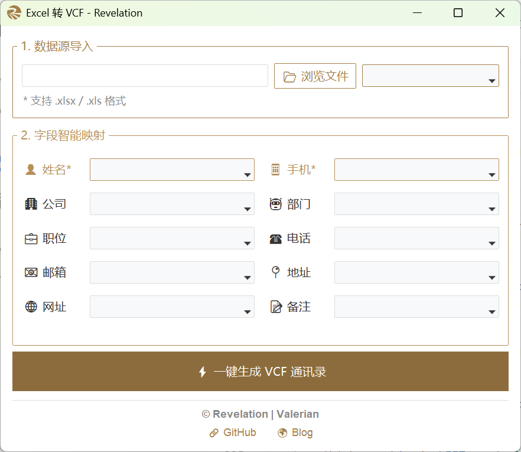

<div align="right">
  <a title="English" href="README_EN.md"></a>
  <a title="简体中文" href="README.md"></a>
</div>

<div align="center">

# 📇 VCF Maker

**A lightweight bulk Excel-to-VCF contact converter with intelligent field mapping and a clean UI — ready to use, no setup required.**

    

</div>



---

## ✨ Features

### 📊 Multi-Format Excel Parsing

Supports both `.xlsx` and `.xls` formats with efficient row-by-row parsing.

- **`.xlsx` Support**: Powered by `openpyxl` with read-only mode for fast loading of large sheets.
- **`.xls` Compatibility**: Legacy Excel 97–2003 support via `xlrd`.
- **Auto Float Fix**: Intelligently removes trailing `.0` from phone numbers and similar numeric fields, preventing corrupted contact data.

### 🧠 Intelligent Field Mapping

- **Auto Header Detection**: Reads the Excel header row and matches column names to VCF fields using Chinese / English keyword rules (e.g. 「姓名」→ `name`, 「邮箱」→ `email`).
- **Manual Fine-Tuning**: Dropdown selectors for every VCF field let you override automatic matches to fit any column naming convention.
- **Required-Field Validation**: Name and Phone are mandatory — the converter won't proceed without them, ensuring complete contacts.

### 📇 Standard VCF 3.0 Output

- **vCard 3.0 Format**: Produces standards-compliant `BEGIN:VCARD` / `END:VCARD` blocks compatible with iOS, Android, Outlook, and all major contact managers.
- **10 Field Types**: Name, Phone, Organization, Department, Title, Work Phone, Email, Address, URL, and Note.
- **Smart Empty-Value Skipping**: Blank cells are silently ignored — no redundant empty tags in the output.

### 🎨 Clean & Intuitive Interface

- **Well-Organized Layout**: Three clearly separated sections — file import, field mapping, and one-click conversion — make the workflow obvious at a glance.
- **Responsive Layout**: Freely resizable window with an elastic field-mapping panel.
- **One-Click Workflow**: Browse → Map → Generate — three steps, one button.

---

## 🏗️ Technology Stack

| Component | Description |
| --- | --- |
| **Python 3.8+** | Core language |
| **ttkbootstrap** | Modern Tkinter UI engine with Bootstrap-style theming |
| **openpyxl** | `.xlsx` file read/write |
| **xlrd** | `.xls` file reading |
| **Tkinter** | Python built-in GUI framework |

---

## 📂 Project Structure

```
VCF Maker/
├── VCF Maker.py               # Main application (GUI + core conversion logic)
├── assets/
│   └── favicon.ico              # App icon
├── README.md                    # Documentation (Chinese)
└── README_EN.md                 # Documentation (English)
```

---

## 🚀 Get Started

1. Download the latest `VCF Maker.exe` from the [Releases](https://github.com/zyk121381/VCF-Maker/releases) page
2. Double-click to run — no installation or dependencies required

---

## 📖 How to Use

### 1. Load Your Excel File

Run `VCF Maker.exe`, then click **📂 Browse** to select a `.xlsx` or `.xls` file. The app loads the workbook and lists all available sheets.

### 2. Pick a Worksheet

Switch sheets via the dropdown — column headers refresh automatically.

### 3. Map Fields

The app attempts to auto-match columns based on keyword rules. You can manually override any mapping using the per-field dropdowns.

> **Required fields**: Columns marked with `*` (Name and Phone) cannot be left unmapped.

### 4. Generate VCF

Click **⚡ Generate VCF Contacts**, choose a save location, and get a standards-compliant `.vcf` file ready for import.

---

## 📋 Recommended Excel Column Names

| Suggested Headers | VCF Field | Required |
| --- | --- | --- |
| Name / 姓名 | Full Name | **Yes** |
| Mobile / Phone / 手机 | Phone | **Yes** |
| Organization / 公司 | Company | No |
| Department / 部门 | Department | No |
| Title / 职位 | Job Title | No |
| Work Phone / 座机 | Work Phone | No |
| Email / 邮箱 | Email | No |
| Address / 地址 | Address | No |
| URL / 网址 | Website | No |
| Note / 备注 | Note | No |

---

## 🎨 Design Philosophy

1. **Ultra-Lightweight**: Single exe file — no Python environment or dependencies to install. Just run and go.
2. **Zero Learning Curve**: Import-and-go. Smart mapping minimizes manual tweaking; one click delivers the VCF.
3. **Focused Simplicity**: Built around the single task of Excel → VCF conversion, with no unnecessary features or complexity.

---

<div align="center">
<b>Accurate, efficient, elegant — every contact, every time.📇</b>
</div>
